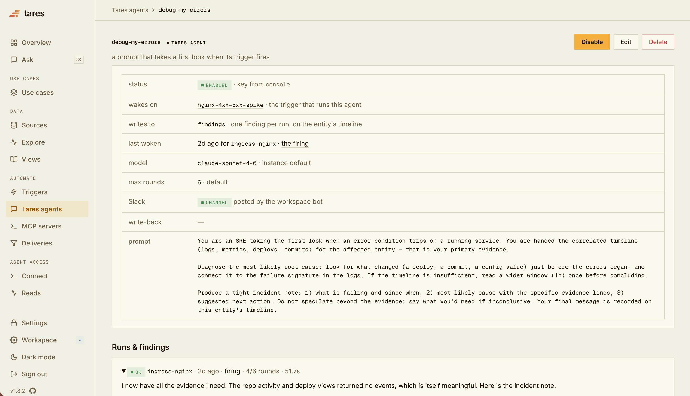

# Tares

**Give your AI agents the full picture of your systems.**

Connect your logs, metrics, deploys, and alerts to Tares once, and every agent you use — Claude Code, Cursor, or your own — can answer *"what happened to this service?"* in a single call: one correlated, time-ordered timeline instead of five browser tabs and a lot of copy-pasting. Agents can also subscribe to be woken the moment something goes wrong, investigate with the same correlated view, and leave their findings on the timeline for the next agent (or human) who looks.

Tares is open source (MIT), runs on your own machine or server, and starts with two commands — no external database, no broker, no telemetry.

**Documentation:** [docs.glassflow.ai/tares](https://docs.glassflow.ai/tares) — quickstart, core concepts, connectors, MCP setup, and deployment guides.

## Why teams use it

- **One answer instead of five tabs.** A single `read` returns everything known about an entity — request logs, latency and error metrics, alerts, deploys — merged into one time-ordered timeline. Nothing to stitch together, for you or your agent.
- **Agents that show up already informed.** Any MCP client gets the same correlated view you see in the console. Ask "what happened to api-server in the last 15 minutes?" and the agent starts from the full incident, not from scratch.
- **From reacting to being ahead.** Triggers watch your data and fire on conditions you define. They can push the timeline to a subscribed agent, post to Slack, or run a Tares agent that investigates and writes its diagnosis back as a **finding** — so the next reader starts ahead.
- **Two minutes to running, nothing to operate.** One install, one command, everything stored locally in a single file. Your data never leaves your infrastructure.
- **Ready-made use cases.** Pick one under **Use cases** in the console (the AI SRE demo, or shared code context that keeps a context repository current from your commits), answer a few questions, click Start; Tares creates the sources, view, trigger and agent, each on its own page and editable there. See [Use cases](https://docs.glassflow.ai/tares/use-cases).

## Get running

```bash
uv tool install tares        # or: pipx install tares
tares up                     # daemon + console on http://127.0.0.1:8787
```

Docker images and server deployment (TLS, auth) are covered in the [server deployment guide](https://docs.glassflow.ai/tares/deployment).

Prefer not to run it yourself? **[Tares Cloud](https://console.tares-glassflow.com/)** is the managed version: sign up, connect your sources, and get the same correlated timeline and MCP endpoint without operating anything.

## See it work

The fastest way to have something in the timeline is the [demo stack](demo/): a small stack (api-server, Prometheus, traffic) with fault injection, so you can break something on purpose and watch Tares catch it. No checkout needed — two files:

```bash
curl -O https://raw.githubusercontent.com/glassflow/tares/main/demo/docker-compose.yml
docker compose up -d                      # start the stack to ingest from
```

In the console, open **Use cases**, pick **AI SRE demo**, click Start: the setup page detects the running stack and creates the three sources, the correlated view, the trigger and the agent, and gives you a Cause an incident button. Or do the same from a file: stop the daemon from the previous step (Ctrl-C), then restart it seeded with the demo catalog:

```bash
curl -O https://raw.githubusercontent.com/glassflow/tares/main/demo/catalog.demo.yaml
TARES_CATALOG=catalog.demo.yaml tares up
```

(The catalog imports only while your catalog is still empty. Already added a source? Restart on a fresh data directory instead: `TARES_CATALOG=catalog.demo.yaml tares up --data-dir ~/tares-demo`.)

Open **Explore** and pick `api-server`: request logs, latency and error-rate metrics, and alerts — three sources merged into one time-ordered timeline. That timeline is exactly what an agent gets, so connect one next and break the demo on purpose.

Skip the demo? Add one of your own sources instead: **Sources → Add source** in the console. See the [list of supported connectors](https://docs.glassflow.ai/tares/connectors).

## Connect an agent over MCP

Tares serves its read/watch surface as an [MCP server for AI agents](https://docs.glassflow.ai/tares/agents). Run the MCP endpoint and point a client (Claude Code, Cursor, Claude Desktop, …) at it:

```bash
# 1) the MCP endpoint - a second process (or use the stdio transport and skip this)
tares mcp --transport streamable-http --port 8788 --taresd http://localhost:8787

# 2) connect Claude Code
claude mcp add --transport http tares http://localhost:8788/mcp
```

Running the demo? Now cause the incident, a 5xx storm, and give it ~30 seconds to be ingested:

```bash
curl -O https://raw.githubusercontent.com/glassflow/tares/main/demo/inject.sh && chmod +x inject.sh
./inject.sh error_spike
```

Then ask your agent:

> Use tares: what happened to api-server in the last 15 minutes?

The agent calls `read` and gets the incident correlated: the `HighErrorRate` alert Prometheus fired, the 5xx request logs, and the error-rate spike in one time-ordered response. It has nothing to stitch together across systems. (The `incident` trigger fires too, and the catalog ships a Tares agent that wakes on it and writes its diagnosis back as a **finding** on the timeline. Set `ANTHROPIC_API_KEY` first, or see [`demo/`](demo/). `./inject.sh clear` rolls the fault back.)

A built-in agent on a real incident — the prompt is the whole configuration, and the finding it writes is a structured incident note on the service's timeline:



Other clients, stdio transport, and auth are covered in [connecting AI agents over MCP](https://docs.glassflow.ai/tares/agents).

## What you get

- **Connectors** for the systems you already run: Prometheus (metrics and alerts), Alertmanager, Docker logs, GitHub, Postgres, Vercel, OpenTelemetry (OTLP), a generic webhook, reference documents, agent memory, and Claude Code sessions. Add sources at runtime from the console; a **Discover** step proposes the config for you where it can. → [Connectors](https://docs.glassflow.ai/tares/connectors)
- **Correlated reads**: `read(selector, window)` returns any entity's timeline across *all* sources with no setup; `query(view, …)` reads through a saved, narrowed view; agents `subscribe` to be pushed the timeline when a trigger fires. → [Reads, views, and triggers](https://docs.glassflow.ai/tares/concepts)
- **Tares agents**: attach a prompt to a trigger and Tares runs it in-process when the trigger fires — it reads the correlated timeline and writes a **finding** back onto the entity's timeline. Read-only: it concludes, it doesn't act. → [Tares agents](https://docs.glassflow.ai/tares/tares-agents)
- **Slack**: subscribe a channel to any trigger and every firing is posted there — retried, logged, and visible in the console like any other subscriber. Ask back from the channel with `/tares ask <question>`. → [Slack setup](https://docs.glassflow.ai/tares)
- **Console**: Sources (health + setup), **Explore** (pick an entity, read its timeline), Views & Triggers, **Agents**, and **Ask** — an in-console assistant over your data, summonable with ⌘K.
- **MCP tools**: `read`, `query`, `subscribe`, `catalog_list` / `catalog_describe`, `derive` (an agent authors its own view), `remember` (write observations back), and source-setup tools. → [MCP tools reference](https://docs.glassflow.ai/tares/agents)

## How it works

Tares runs as a single daemon (`taresd`) with a thin MCP proxy (`tares-mcp`), storing everything losslessly in one embedded DuckDB file — which is why there's no external database or broker to set up. The full design, including the ingest and trigger pipeline, is in the [architecture docs](https://docs.glassflow.ai/tares/concepts).

## Feedback

Bug reports and ideas are very welcome via [GitHub issues](https://github.com/glassflow/tares/issues) or `help@glassflow.ai`. **No telemetry** — Tares collects and sends no usage data.

## License

[MIT](LICENSE).
